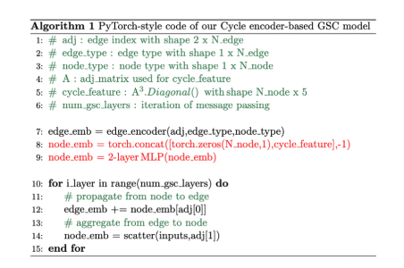

# Improving Commonsense-based QA Model through a Cycle-Encoder

[한국정보과학회](https://www.kiise.or.kr/conference/KSC/2022/)에서 우수 논문상을 수상한 논문입니다.

If you have any questions, please feel free to ask!

If you look at the paper, it is applied to two models, QA-GNN and GSC.

## Oveview

## Preliminaries
1. We need the code for the two models, [QA-GNN](https://github.com/michiyasunaga/qagnn) and [GSC](https://github.com/kuan-wang/graph-soft-counter), as we conducted experiments on them.

## How to run:

We only provide the code for counting cycles for each node.
