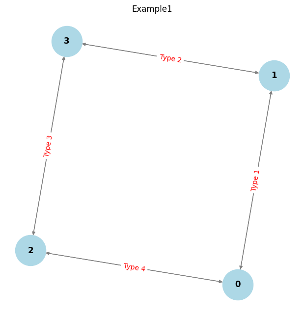

# Improving Commonsense-based QA Model through a Cycle-Encoder

[한국정보과학회](https://www.kiise.or.kr/conference/KSC/2022/)에서 우수 논문상을 수상한 논문입니다.


If you have any questions, please feel free to ask!

If you look at the paper, it is applied to two models, QA-GNN and GSC.

## Oveview


## Preliminaries
1. We need the code for the two models, [QA-GNN](https://github.com/michiyasunaga/qagnn) and [GSC](https://github.com/kuan-wang/graph-soft-counter), as we conducted experiments on them.


## How to run:

We only provide the code for counting cycles for each node.

If you want to see how the cycles are printed,
```
python ./cycle_count.py
```

The example diagram is as follows.



The results are as belows.
```
Detected Cycles: [[0, 2, 3, 1], [0, 1, 3, 2]]

```
## Additional Information 😢😢

Unfortunately, this research was discontinued due to identified limitations.


## Acknowledgment
This repo is built upon the following works:
```
QA-GNN: Reasoning with Language Models and Knowledge Graphs for Question Answering. Michihiro Yasunaga and Hongyu Ren and Antoine Bosselut and Percy Liang and Jure Leskovec. NAACL 2021. 
https://github.com/michiyasunaga/qagnn

GNN is a Counter? Revisiting GNN for Question Answering. Wang, Kuan and Zhang, Yuyu and Yang, Diyi and Song, Le and Qin, Tao. ICLR 2022.
https://github.com/kuan-wang/graph-soft-counter

```
Many thanks to the authors and developers!
